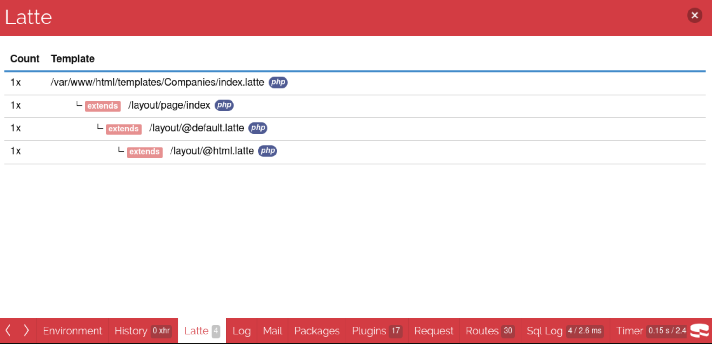

# Debugging

This plugin provides several debugging tools to help you inspect variables and understand template structure during development.

## Debug Tags

| Tag | Description |
|-----|-------------|
| `{dump $var}` or `{debug $var}` | Uses CakePHP's `Debugger::printVar()` instead of Nette's default dumper |
| `{dump}` | Dumps all defined variables using CakePHP's debugger |

**Example usage:**
```latte
{* Debug a specific variable *}
{dump $user}
{debug $posts}

{* Debug all template variables *}
{dump}
```

## DebugKit Integration



When DebugKit is installed and debug mode is enabled, this plugin provides a dedicated "Latte" panel in the DebugKit toolbar. The panel displays:

- Visual tree representation of your template structure
- Template inheritance hierarchy
- Layout relationships
- Template compilation information

### Setup

1. Ensure `cakephp/debug_kit` is installed and enabled in development
2. Add the Latte panel to your DebugKit configuration:

```php
// In your bootstrap.php or Application.php
Configure::write('DebugKit.panels', ['LatteView.Latte']);
```

3. The panel will appear as "Latte" in the DebugKit toolbar